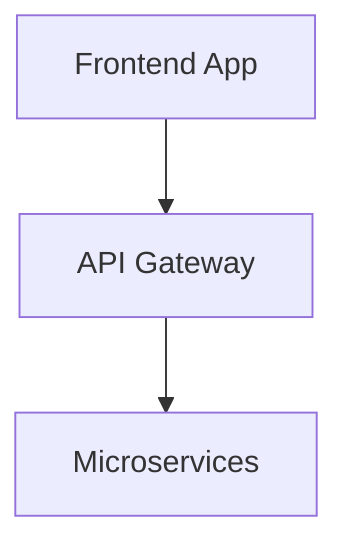
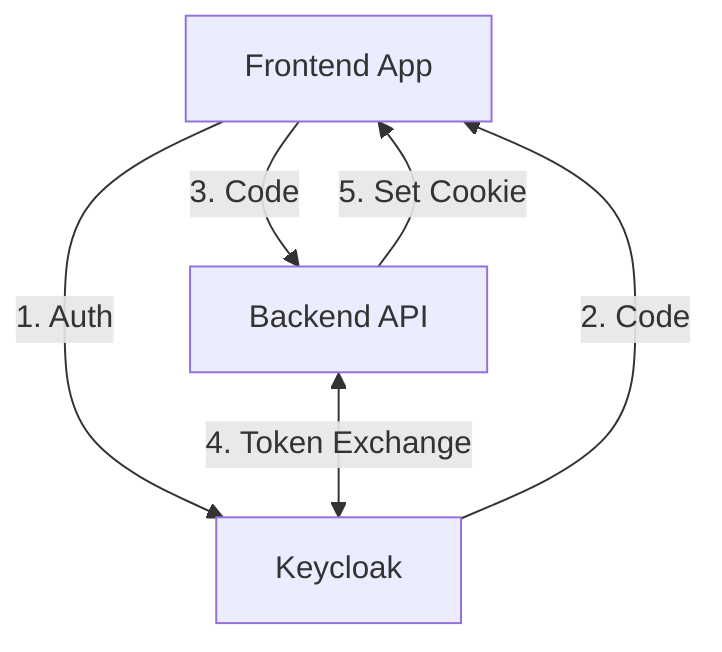
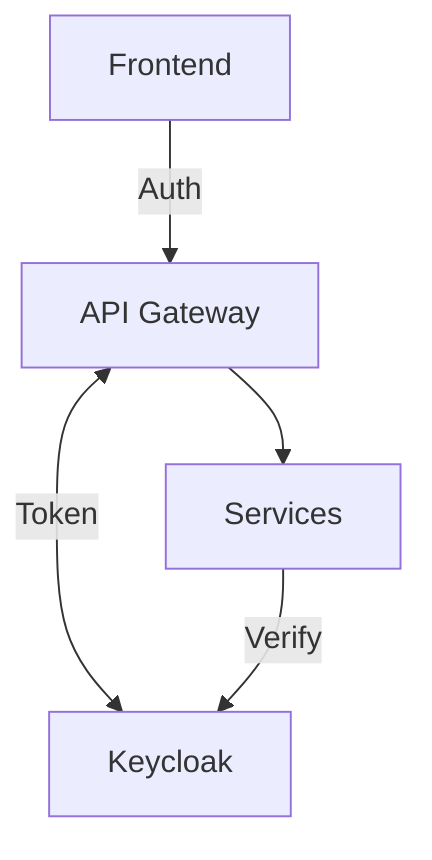

# Simplifying Authentication in Microservice Architectures with Keycloak

In today's complex application landscapes, microservice architectures have become the standard for building scalable, maintainable systems. However, with this architectural shift comes a significant challenge: **authentication and authorization**.

This blog post explores how to simplify authentication flows in microservice architectures using Keycloak as an identity provider, focusing on secure token handling, centralized authentication, and simplified implementation.

## The Authentication Challenge in Microservices

Traditional monolithic applications had a straightforward authentication approach - a single authentication system for the entire application. In contrast, microservice architectures introduce several challenges:



### Key Challenges:

1. **Multiple Authentication Points**: Each microservice potentially needs to verify user identity
2. **Secret Management**: Secure storage of client secrets and keys
3. **Token Verification**: Each service needs to validate tokens independently
4. **Consistent Implementation**: Maintaining consistent auth logic across services
5. **Frontend Complexity**: Frontend applications need to handle token management securely

### Common Anti-Patterns

Many teams fall into these common traps:

- **Storing tokens in localStorage**: Vulnerable to XSS attacks
- **Implementing custom auth in each microservice**: Leads to inconsistency and security gaps
- **Duplicating auth logic**: Creates maintenance nightmares
- **Passing tokens through multiple services**: Increases attack surface
- **Duplicating security measures**: Different implementations for local/staging/production environments often lead to mistakes
- **Environment-specific solutions**: Can lead to catastrophic security failures when code moves between environments

## The Solution: Centralized Identity with Keycloak

Keycloak provides a comprehensive identity and access management solution that addresses these challenges:



### Key Benefits:

1. **Centralized Authentication**: Single source of truth for identity
2. **Secure Token Handling**: Tokens stored in HTTP-only cookies
3. **JWKS Verification**: Services verify tokens using public keys
4. **Standardized Implementation**: Consistent auth across services
5. **Reduced Frontend Complexity**: Frontend delegates token handling to backend

## Implementation Details

Let's look at how we implemented this solution using React for the frontend and Node.js for the backend.

### 1. Frontend Authentication Flow

The frontend initiates the authentication flow but delegates the token handling to the backend:

```jsx
// authService.js - Initiates login without handling tokens directly
initiateLogin() {
  const redirectUri = `${window.location.origin}/callback`;
  const encodedRedirectUri = encodeURIComponent(redirectUri);

  const authUrl = `${KEYCLOAK_URL}/protocol/openid-connect/auth?client_id=${CLIENT_ID}&redirect_uri=${encodedRedirectUri}&response_type=code&scope=openid email profile&state=${Date.now()}`;

  window.location.href = authUrl;
}
```

After authentication, the code is exchanged for tokens through the backend:

```jsx
// authService.js - Exchanges code for token via backend
async exchangeCodeForToken(code) {
  const redirectUri = `${window.location.origin}/callback`;

  const response = await axios.post(
    '/api/token',
    {
      code: code,
      redirect_uri: redirectUri,
    },
    {
      withCredentials: true, // Important for cookies to be sent/received
    }
  );

  return response.data;
}
```

### 2. Secure Backend Token Exchange

The backend securely exchanges the authorization code for tokens:

```javascript
// Token exchange endpoint
app.post('/api/token', async (req, res) => {
  try {
    const { code, redirect_uri } = req.body

    // Exchange the authorization code for tokens
    const tokenData = await tokenService.exchangeCodeForTokens(
      code,
      redirect_uri,
    )

    // Set cookies with the tokens
    tokenService.setCookies(res, tokenData)

    // Extract user info from token with verification
    const user = await tokenService.extractUserFromToken(
      tokenData.access_token,
      jwksService,
    )

    res.json({
      message: 'Authentication successful',
      user,
      expiresIn: tokenData.expires_in,
    })
  } catch (error) {
    console.error(
      'Token exchange error:',
      error.response?.data || error.message,
    )
    res.status(401).json({
      error: 'Token exchange failed',
      details: error.response?.data || error.message,
    })
  }
})
```

### 3. Secure Token Storage

Tokens are stored in HTTP-only cookies, not in localStorage:

```javascript
// tokenService.js - Setting secure HTTP-only cookies
setCookies(res, { access_token, refresh_token, expires_in }) {
  // Set the access token as an HTTP-only cookie
  res.cookie('auth_token', access_token, {
    httpOnly: true,
    secure: process.env.NODE_ENV === 'production',
    sameSite: 'strict',
    maxAge: expires_in * 1000,
  });

  // Store refresh token in a separate cookie
  if (refresh_token) {
    res.cookie('refresh_token', refresh_token, {
      httpOnly: true,
      secure: process.env.NODE_ENV === 'production',
      sameSite: 'strict',
      maxAge: 30 * 24 * 60 * 60 * 1000, // 30 days
    });
  }
}
```

### 4. Token Verification with JWKS

Tokens are verified using Keycloak's JSON Web Key Set (JWKS):

```javascript
// jwksService.js - Verifying tokens with JWKS
async verifyToken(token) {
  try {
    const jwks = await this.getJwks();

    // Verify the token
    const { payload } = await jose.jwtVerify(token, jwks, {
      issuer: this.keycloakUrl,
      audience: 'account'  // This might need to be adjusted based on your Keycloak configuration
    });

    return payload;
  } catch (error) {
    console.error('Token verification failed:', error.message);
    throw error;
  }
}
```

### 5. Protected API Endpoints

API endpoints are protected using middleware that verifies the token:

```javascript
// auth.js middleware - Extracting and verifying JWT from cookies
const extractJwtToken = (jwksService) => async (req, res, next) => {
  try {
    // First check for token in cookie
    const token = req.cookies.auth_token

    // Fallback to Authorization header if no cookie
    const authHeader = req.headers.authorization
    const headerToken =
      authHeader && authHeader.startsWith('Bearer ')
        ? authHeader.split(' ')[1]
        : null

    // Use token from cookie or header
    const accessToken = token || headerToken

    if (!accessToken) {
      return res.status(401).json({ error: 'Authentication required' })
    }

    try {
      // Verify the token using JWKS
      const decodedToken = await jwksService.verifyToken(accessToken)

      req.user = {
        id: decodedToken.sub,
        email: decodedToken.email,
        name: decodedToken.name,
        preferred_username: decodedToken.preferred_username,
        source: 'keycloak',
      }

      next()
    } catch (tokenError) {
      console.error('Token verification error:', tokenError.message)
      return res.status(401).json({ error: 'Invalid token' })
    }
  } catch (error) {
    console.error('Authentication error:', error)
    res.status(401).json({ error: 'Authentication failed' })
  }
}
```

## OWASP Security Considerations

The [OWASP Foundation](https://owasp.org/) provides security guidelines that we've incorporated:

### Why Not localStorage?

OWASP strongly advises against storing tokens in localStorage or sessionStorage:

1. **Vulnerable to XSS Attacks**: Any JavaScript on your page can access localStorage
2. **No Expiration Mechanism**: localStorage has no built-in expiration
3. **Available to All Scripts**: Any third-party script can access tokens

### Secure Token Storage Best Practices

Our implementation follows these OWASP recommendations:

1. **HTTP-Only Cookies**: Prevents JavaScript access to tokens
2. **Secure Flag**: Ensures cookies are only sent over HTTPS
3. **SameSite Attribute**: Prevents CSRF attacks
4. **Short Expiration**: Access tokens expire quickly
5. **Backend Token Exchange**: Client secrets never exposed to frontend

## Scaling to Multiple Microservices

This pattern scales well to multiple microservices:



Each microservice can independently verify tokens using Keycloak's JWKS endpoint, without needing to share secrets.

## Performance Considerations

A common concern with token verification is the potential performance impact of making external API calls for every request. However, with proper implementation, this overhead can be minimized:

### JWKS Caching

The JWKS (JSON Web Key Set) contains the public keys used to verify token signatures. Instead of fetching these keys for every request, we can cache them:

```javascript
// Caching JWKS for better performance
async getJwks() {
  // Check if we need to refresh the JWKS
  const now = Date.now();
  if (!this.keyStore || !this.lastFetched || (now - this.lastFetched > this.cacheExpiryMs)) {
    try {
      console.log('Fetching JWKS from', this.jwksUri);
      const response = await axios.get(this.jwksUri);

      // Create a JWKS from the response
      this.keyStore = await jose.createRemoteJWKSet(new URL(this.jwksUri));
      this.lastFetched = now;

      console.log('JWKS fetched successfully');
    } catch (error) {
      console.error('Error fetching JWKS:', error.message);
      throw error;
    }
  }

  return this.keyStore;
}
```

With this approach, the JWKS is only fetched once and then cached for a configurable period (typically hours). All token verifications during this period use the cached keys, making the verification process extremely fast and eliminating network calls.

### In-Memory Verification

Once the public keys are cached, token verification happens entirely in memory:

1. The JWT signature is verified using the cached public key
2. Claims like expiration time, issuer, and audience are validated
3. No external API calls are needed for routine token verification

This makes token verification nearly as fast as simple token decoding, with the added security of cryptographic validation.

### Keycloak Deployment Options

For production environments, you'll need to deploy Keycloak. Here are some options:

#### Kubernetes Deployment with Helm

Keycloak can be easily deployed to Kubernetes using the official Helm chart:

```bash
# Add the Keycloak Helm repository
helm repo add keycloak https://codecentric.github.io/helm-charts
helm repo update

# Install Keycloak
helm install keycloak keycloak/keycloak \
  --namespace auth \
  --create-namespace \
  --set keycloak.persistence.deployPostgres=true \
  --set keycloak.persistence.dbVendor=postgres
```

This deploys Keycloak with a PostgreSQL database for persistence. For production, you'll want to configure:

- High availability with multiple replicas
- Proper resource limits and requests
- TLS certificates for secure communication
- Integration with your existing database
- Backup and disaster recovery procedures

#### Managed Options

For teams that prefer not to manage Keycloak themselves:

- **Red Hat SSO**: Commercial support for Keycloak
- **AWS Cognito**: AWS's managed identity service (different API but similar concepts)
- **Auth0**: Commercial identity platform with similar capabilities
- **Okta**: Enterprise identity management solution

Each option has its own trade-offs in terms of cost, control, and integration complexity.

## Conclusion

By centralizing authentication with Keycloak and implementing secure token handling patterns, we've simplified authentication in our microservice architecture while maintaining high security standards.

Key takeaways:

1. **Delegate token handling to the backend**
2. **Store tokens in HTTP-only cookies**
3. **Verify tokens using JWKS**
4. **Centralize authentication with Keycloak**
5. **Follow OWASP security guidelines**

This approach reduces complexity, improves security, and makes your authentication system more maintainable as your microservice architecture grows.

## Further Reading

For the complete implementation, check out our [GitHub repository](https://github.com/yourusername/keycloak-auth-demo) with detailed documentation and code examples.

The README provides step-by-step instructions for setting up and running the demo application.
